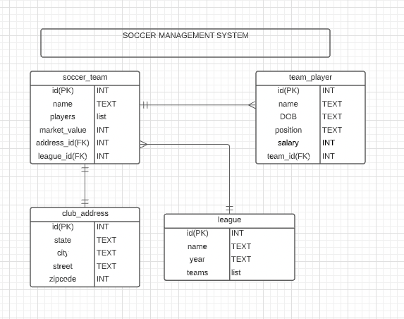

# Soccer-Data-Base API

## GOAL

Create a Soccer Management System using Spring Boot RESTful API that performs CRUD operations by making a database call to a Postgres SQL database using JPA(JAVA Persistence API). The system should have proper functionality to register soccer leagues, teams in each league, and players in each team. Also the functionality to read, update and delete leagues/teams/players. 
## Entity Relationship Diagram (ERD):

## User Stories

| |
| --- |
|1. One league can have many teams
|2. Many teams can belong to one league
|3. One club can have only one address
|4. One team can have many players
|5. As a user, I would like to view a list of soccer leagues.
|6. As a user, I would like to add a league.
|7. As a user, I would like to add a team in the league.
|8. As a user, I would like to modify a player salary/position.
|9. As a user, I would like to delete a player from the team.
|10. As a user, I would like to list all the players in the team.

## System Tools Used

- Spring Boot
- Postgres
- Lucid App
- IntelliJ IDEA/Java 17
- Postman

## Endpoints

| ENDPOINT | FUNCTIONALITY |
| --- | :--- |
| GET _/api/teams/_ | GET all Teams
| GET _/api/teams/{teamId}/_ | GET team by ID
| POST _/api/teams/_ | POST a new team
| DELETE _/api/teams/{teamId}/_ | DELETE a team by ID
| POST _/api/teams/{teamId}/players/_ | POST a player in a team
| PUT _/api/teams/{teamId}/_ | PUT update a team by ID
| GET _/api/teams/{teamId}/players/_ | GET a list of players for the team with id specified
| GET _/api/teams/{teamId}/players/{playerId}/_ | GET a player from a team
| DELETE _/api/teams/{teamId}/players/{playerId}/_ | DELETE a player from the a team
| PUT _/api/teams/{teamId}/players/{playerId}/_ | PUT update a player in the team
| POST _/api/address/_ | POST create a new address
| PUT _/api/address/{addressId}/_ | PUT update an address
| GET _/api/leagues/_ | GET all the leagues
| DELETE _/api/leagues/{leagueId}/_ | DELETE a league by id
| POST _/api/leagues/_ | POST new league
| PUT _/api/leagues/{leagueId}/_ | PUT to change a league
| POST _/api/leagues/{leagueId}/teams/{teamId}/_ | POST a team through a league id

## Project Challenges

