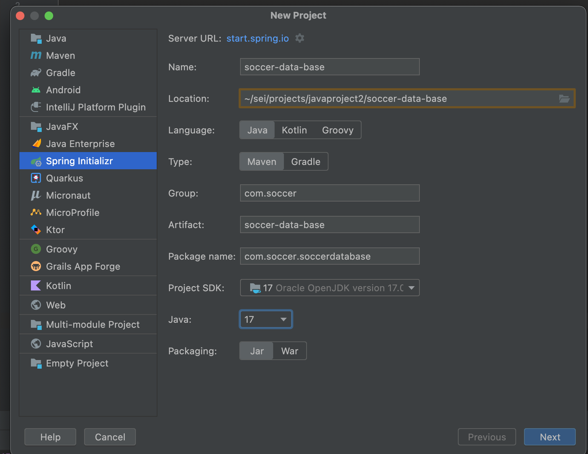
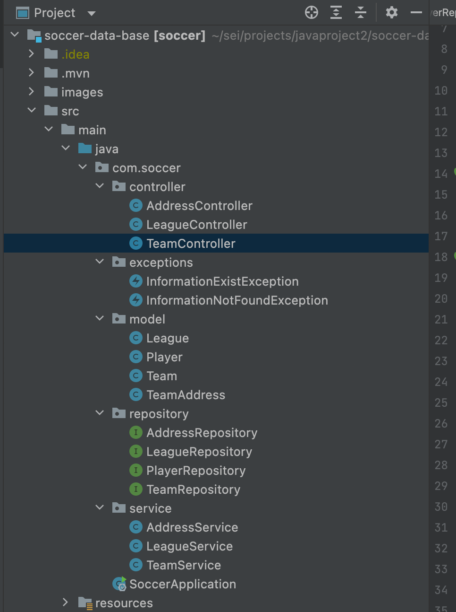

# Soccer-Data-Base API

## GOAL

Create a Soccer Management System using Spring Boot RESTful API that performs CRUD operations by making a database call to a PostgreSQL database using JPA(JAVA Persistence API). The system should have proper functionality to register soccer leagues, teams in each league, and players in each team. Also add the functionalities to read, update and delete leagues/teams/players. 

## Project initialization and setup
- Spring initializer

## Maven dependencies
The dependency section contains the dependencies I added to the project namely Spring Data JPA, PostgreSQL driver, and SpringWeb.
- Pom.xml file dependencies

## Configuring PostgreSQL, JPA, and Hibernate
In the resources folder I changed I added a new file application-dev.properties to hold the configurations
- Application-dev.properties file

## Project Structure
1.  Controller: This package will house the LeagueController and TeamController for calling the right Service
2.  Exceptions: This package holds the custom exceptions
3.  Model: This package holds all the Entites classes
4.  Repository: This package holds the repositories for accessing Jpa interface and accessing the database
5.  Service: This package holds the business logic

## Testing with Postman 
- #### Get all teams

- #### Create new teamPlayer

- #### Delete team by id

- #### Update team by id

## Entity Relationship Diagram (ERD):

## User Stories

| |
| --- |
|1. One league can have many teams
|2. Many teams can belong to one league
|3. One club can have only one address
|4. One team can have many players
|5. As a user, I would like to view a list of soccer leagues.
|6. As a user, I would like to add a league.
|7. As a user, I would like to add a team in the league.
|8. As a user, I would like to modify a player salary/position.
|9. As a user, I would like to delete a player from the team.
|10. As a user, I would like to list all the players in the team.

## System Tools Used

- Spring Boot
- PostgreSQL
- Lucid App
- IntelliJ IDEA/Java 17
- Postman

## Endpoints

| ENDPOINT | FUNCTIONALITY |
| --- | :--- |
| GET _/api/teams/_ | GET all Teams
| GET _/api/teams/{teamId}/_ | GET team by ID
| POST _/api/teams/_ | POST a new team
| DELETE _/api/teams/{teamId}/_ | DELETE a team by ID
| POST _/api/teams/{teamId}/players/_ | POST a player in a team
| PUT _/api/teams/{teamId}/_ | PUT update a team by ID
| GET _/api/teams/{teamId}/players/_ | GET a list of players for the team with id specified
| GET _/api/teams/{teamId}/players/{playerId}/_ | GET a player from a team
| DELETE _/api/teams/{teamId}/players/{playerId}/_ | DELETE a player from the a team
| PUT _/api/teams/{teamId}/players/{playerId}/_ | PUT update a player in the team
| POST _/api/address/_ | POST create a new address
| PUT _/api/address/{addressId}/_ | PUT update an address
| GET _/api/leagues/_ | GET all the leagues
| DELETE _/api/leagues/{leagueId}/_ | DELETE a league by id
| POST _/api/leagues/_ | POST new league
| PUT _/api/leagues/{leagueId}/_ | PUT to change a league
| POST _/api/leagues/{leagueId}/teams/{teamId}/_ | POST a team through a league id

## Project Challenges
1. The first challenge I faced was designing the ERD for the system and the relashion between the tables. After spending some time on https://vertabelo.com/blog/database-model-for-an-online-store/ I had a better picture how my system will work.
2. Another challenge I faced was the custom methods in the repositories using JpaRepository. I created my custom method in the  repository and it did not work the way I wanted to query. I had to debug my code for some time until I figured out that I had a wrong field name in my query.
3. During the creation of a new team I did notice that the team's address was not deleted after I delete a team. This was resolved by adding the **orphanRemoval = true** in the @Column annotation. 

## Future functionalites
- Adding a User entity with roles admin/user. All admin users will be able to do CRUD, but regular user only GET the data about leagues.