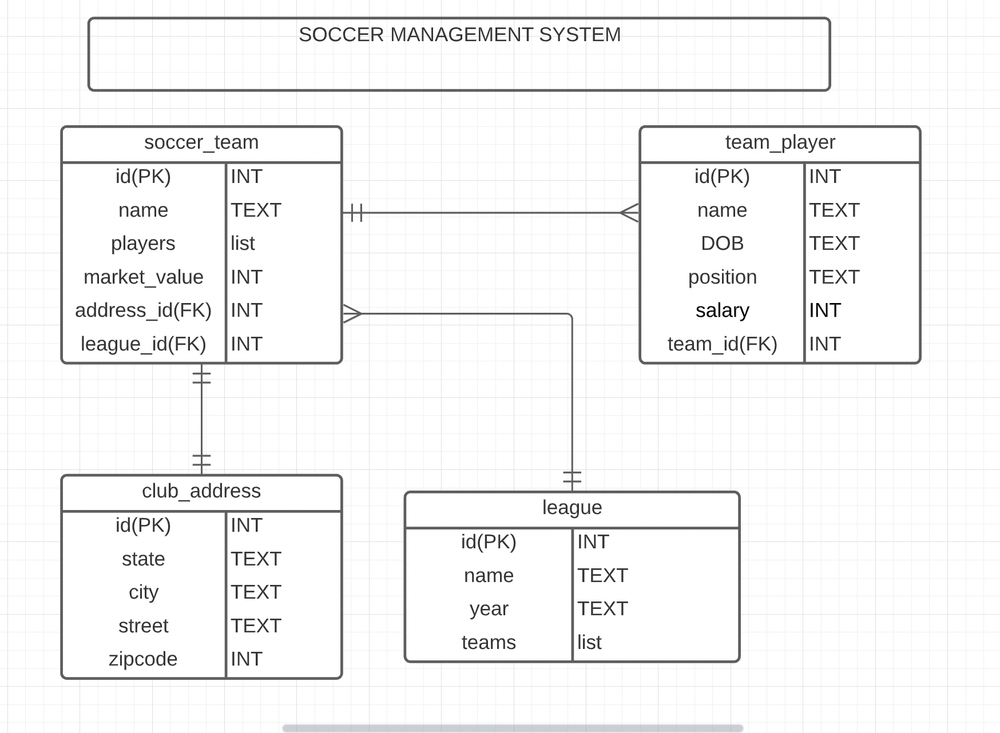

# Soccer-Data-Base API
## Entity Relationship Diagram (ERD):

## User Stories

| |
| --- |
|1. One league can have many teams
|2. One club can have only one address
|3. One team can have many players
|4. As a user, I would like to view a list of soccer leagues.
|5. As a user, I would like to add a league.
|6. As a user, I would like to add a team in the league.
|7. As a user, I would like to modify a player salary/position.
|8. As a user, I would like to delete a player from the team.
|9. As a user, I would like to list all the players in the team.

## System Tools Used

- Spring Boot
- Postgres
- IntelliJ IDEA 2021.3
- Postman

## Endpoints

| ENDPOINT | FUNCTIONALITY |
| --- | :--- |
| GET _/api/teams/_ | GET all Teams
| GET _/api/teams/{teamId}/_ | GET team by ID
| POST _/api/teams/_ | POST a new team
| DELETE _/api/teams/{teamId}/_ | DELETE a team by ID
| POST _/api/teams/{teamId}/players/_ | POST a player in a team
| PUT _/api/teams/{teamId}/_ | PUT update a team by ID
| GET _/api/teams/{teamId}/players/_ GET a list of players for the team with id specified
| GET _/api/teams/{teamId}/players/{playerId}/_ GET a player from a team
| DELETE _/api/teams/{teamId}/players/{playerId}/_ DELETE a player from the a team

